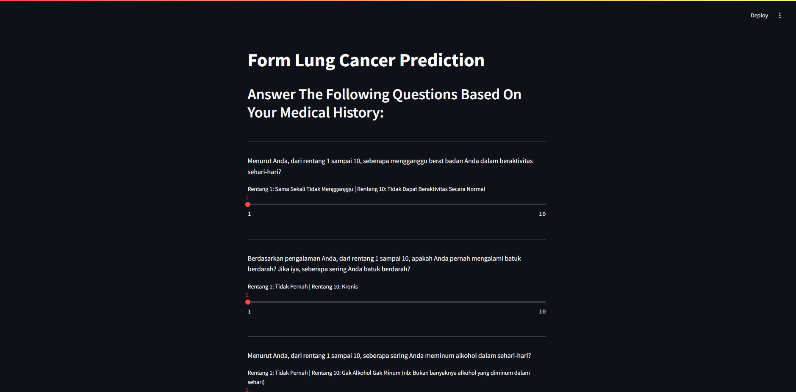

<!-- TABLE OF CONTENTS -->
<details>
  <summary>Table of Contents</summary>
  <ol>
    <li>
      <a href="#about-the-project">About The Project</a>
      <ul>
        <li><a href="#built-with">Built With</a></li>
      </ul>
    </li>
    <li>
      <a href="#getting-started">Getting Started</a>
      <ul>
        <li><a href="#prerequisites">Prerequisites</a></li>
        <li><a href="#installation">Installation</a></li>
      </ul>
    </li>
    <li><a href="#usage">Usage</a></li>
  </ol>
</details>


<!-- ABOUT THE PROJECT -->
## About The Project



The <b>Lung Cancer Prediction Model</b> aims to predict the likelihood of lung cancer in individuals based on various factors such as obesity, alcohol use, coughing up blood, and more. The project leverages a linear regression model to analyze and quantify the relationship between these variables and the risk of developing lung cancer.

<b>Key Objectives:</b>
* <b>Early Detection:</b> By identifying individuals at higher risk, the model aims to facilitate early detection of lung cancer, potentially improving survival rates through timely medical interventions.
* <b>Data-Driven Healthcare:</b> Encourage the use of data analytics in preventive healthcare, helping to assess risk profiles and make informed decisions.

<b>Features:</b>
* <b>Data Preprocessing:</b> The project involves cleaning, normalizing, and transforming the raw dataset to make it suitable for regression analysis.
* <b>Model Development:</b> A linear regression model is built using Python and libraries like Scikit-learn to predict lung cancer risk based on input variables.
* <b>Performance Evaluation:</b> The model is evaluated using metrics such as R-squared (R²) and Mean Squared Error (MSE) to assess its accuracy and reliability.
* <b>Visualization:</b> Graphical representations of the data and model predictions are provided to make insights easier to understand.

<p align="right">(<a href="#about-the-project">back to top</a>)</p>


### Built With

* [![Python][Python]][Python-url]

<p align="right">(<a href="#about-the-project">back to top</a>)</p>


<!-- GETTING STARTED -->
## Getting Started

### Installation

1. Clone the repository
   ```bash
   git clone https://github.com/traviszusa/Lung-Cancer-Prediction-Model-Linear-Regression.git
   ```
2. Make an environment
   ```bash
   python -m venv .venv
   ```
3. Activate the environment
   ```bash
   .venv/Scripts/activate
   ```
4. Install requirements for running the program
   ```bash
   pip install -r requirements.txt
   ```


### Website

1. Activate the environment before
   ```bash
   .venv/Scripts/activate
   ```
2. Run app.py with streamlit library
   ```sh
   streamlit run app.py
   ```

<p align="right">(<a href="#about-the-project">back to top</a>)</p>


<!-- USAGE EXAMPLES -->
## Usage

Answer each question to the end as the user feels and click the “Predict” button to make predictions based on the user's answers to the 12 questions.

<p align="right">(<a href="#about-the-project">back to top</a>)</p>